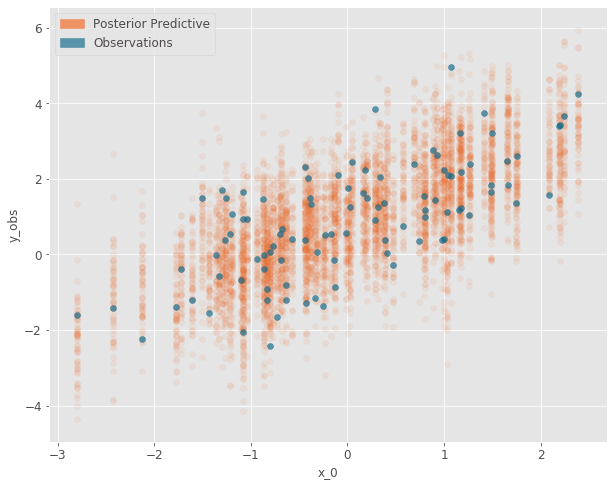

PyMC3-like abstractions for pyro's stochastic function.
Define a model as a stochastic function in pyro.
Use `pm_like` wrapper to create a PyMC3-esque `Model`.
Random variables are exposed to user as attributes of `Model`.
pm-pyro provides abstractions for inference (NUTS : No-U-Turn Sampler), trace plots, posterior plot and posterior predictive plots.


## Install

Install from pypi

```bash
pip install pm-pyro
```

Developer setup
```bash
# install requirements
pip install -r requirements-dev.txt
# run tests
python -m pytest pmpyro/tests.py
```

## Example

Borrowed this example from a [PyMC3 tutorial](https://docs.pymc.io/notebooks/getting_started.html). Outcome variables `Y` is dependent on 2 features `X_1` and `X_2`. The notebook for this example is available [here](notebooks/motivating-example.ipynb)


## Model Specification

We design a simple Bayesian Linear Regression model.


## Stochastic Function

The model specification is implemented as a stochastic function.


```python
import pyro.distributions as dist
import pyro
import torch

def pyro_model(x1, x2, y):
    alpha = pyro.sample('alpha', dist.Normal(0, 10))
    beta = pyro.sample('beta',pdist.Normal(torch.zeros(2,), torch.ones(2,) * 10.))
    sigma = pyro.sample('sigma', dist.HalfNormal(1.))

    # Expected value of outcome
    mu = alpha + beta[0] * x1 + beta[1] * x2

    # Likelihood (sampling distribution) of observations
    return pyro.sample('y_obs', dist.Normal(mu, sigma), obs=y)
```

## Context-manager Syntax

The `pm_like` wrapper creates a PyMC3-esque `Model`. 
We can use the context manager syntax for running inference.
`pm.sample` samples from the model using the NUTS sampler.
The trace is a python dictionary which contains the samples.

```python
from pmpyro import pm_like
import pmpyro as pm

with pm_like(pyro_model, X1, X2, Y) as model:
    trace = pm.sample(1000)
```

```
sample: 100%|██████████| 1300/1300 [00:16, 80.42it/s, step size=7.49e-01, acc. prob=0.911] 
```

## Traceplot

We can visualize the samples using `traceplot`.
Select random variables by passing them as a list via `var_names = [ 'alpha' ... ]` argument.

```python
pm.traceplot(trace)
```


## Plot Posterior

Visualize posterior of random variables using `plot_posterior`.

```python
pm.plot_posterior(trace, var_names=['beta'])
```


## Posterior Predictive Samples

We can sample from the posterior by running `plot_posterior_predictive` or `sample_posterior_predictive` with the same
function signatures as the stochastic function `def pyro_model(x1, x2, y)`, replacing observed variable `Y` with `None`. 

```python
ppc = pm.plot_posterior_predictive(X1, X2, None,
                          trace=trace, model=model, samples=60,
                          alpha=0.08, obs={'y_obs' : Y})
```




## Trace Summary

The summary of random variables is available as a pandas array.

```python
pm.summary()
```


## License

This project is licensed under the GPL v3 License - see the [LICENSE.md](LICENSE.md) file for details
