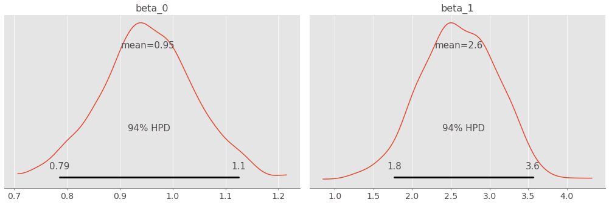

# pm-pyro

PyMC3-like abstractions for pyro. 


## Setup

```
pip install pm-pyro
```

## Example

### Data


### Model Specification


### Stochastic Function

```python
def pyro_model(x1, x2, y):
    alpha = pyro.sample('alpha', pdist.Normal(0, 10))
    beta = pyro.sample('beta', pdist.Normal(torch.zeros(2,), torch.ones(2,) * 10.))
    sigma = pyro.sample('sigma', pdist.HalfNormal(1.))

    # Expected value of outcome
    mu = alpha + beta[0] * x1 + beta[1] * x2

    # Likelihood (sampling distribution) of observations
    return pyro.sample('y_obs', pdist.Normal(mu, sigma), obs=y)
```

### Context-manager Syntax

```python
from pmpyro import pm_like
import pmpyro as pm

with pm_like(pyro_model, X1, X2, Y) as model:
    trace = pm.sample(1000)
```

```
sample: 100%|██████████| 1300/1300 [00:16, 80.42it/s, step size=7.49e-01, acc. prob=0.911] 
```

### Traceplot

```python
pm.traceplot(trace)
```


### Plot Posterior

```python
pm.plot_posterior(trace, var_names=['beta'])
```



### Posterior Predictive Samples

```python
ppc = pm.plot_posterior_predictive(X1, X2, None,
                          trace=trace, model=model, samples=60,
                          alpha=0.08, obs={'y_obs' : Y})
```


### Trace Summary

```python
pm.summary()
```


